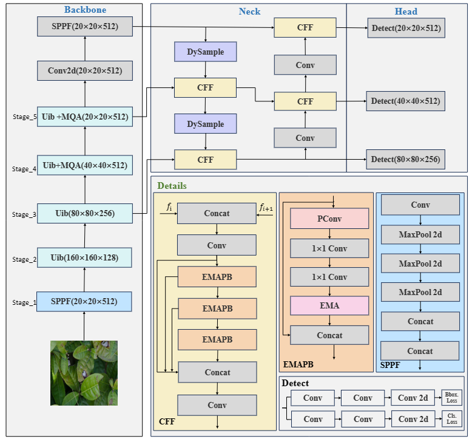
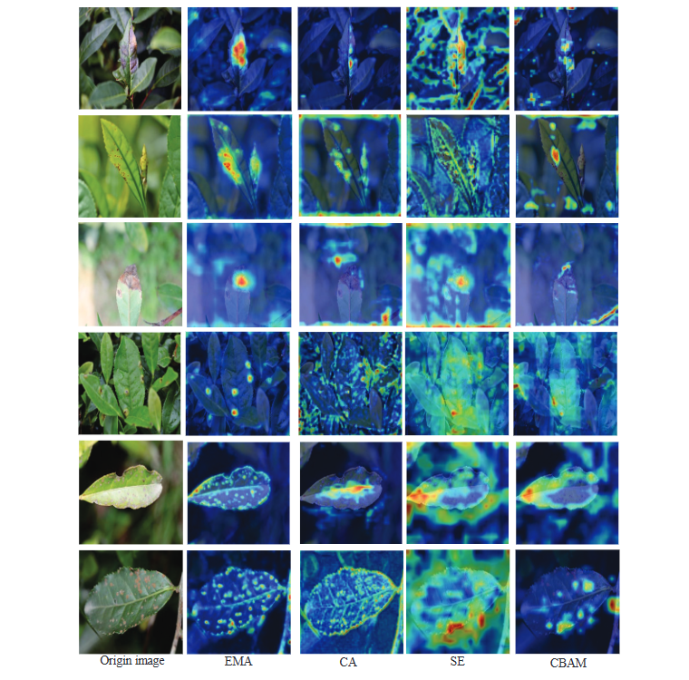
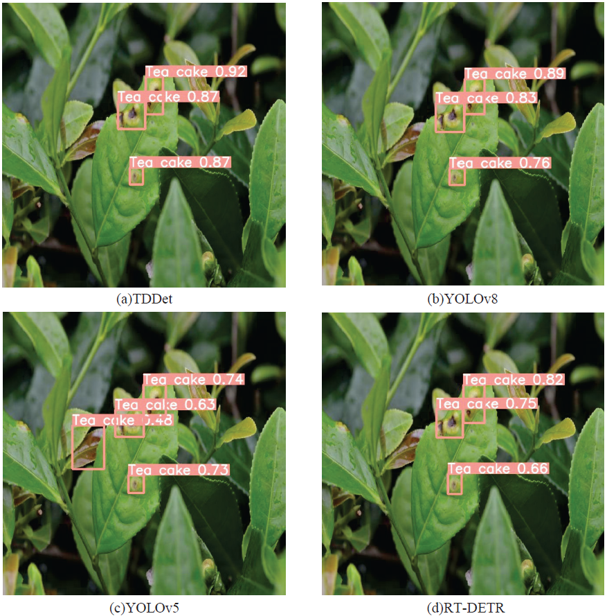

# TDDet: A novel Lightweight and Efficient Tea Disease Detector

TDDet is an lightweight and efficient tea disease detector for quickly and accurately detecting tea diseases.

## TDDet

*Figure 3: The framework of TDDet.*

## dataset

download the dataset: [link](https://pan.baidu.com/s/1cACKNPdyohigHbc8gRZ7ng?pwd=4d02) 

## trained model

We provide .pt of our TDDet trained on the dataset: [TDDet.pt](https://pan.baidu.com/s/1lI9vEgrZJqM_uwTRK4GOjA?pwd=hsfs )

## results (Qualitative results)

## results (Qualitative results)

*Figure 9: Comparative heatmaps of the intensity of regions of interest predicted by different attention mechanisms in TDDet*

---

*Figure 10: Visualization of detection results on randomly selected images under different methods.*
