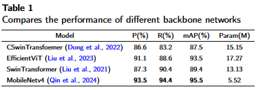
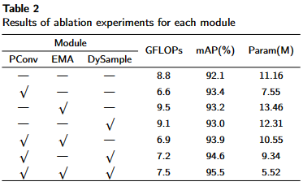
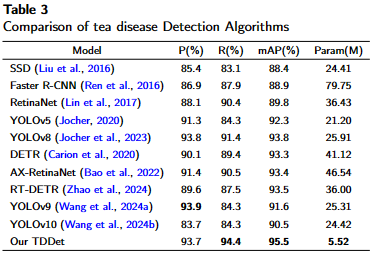
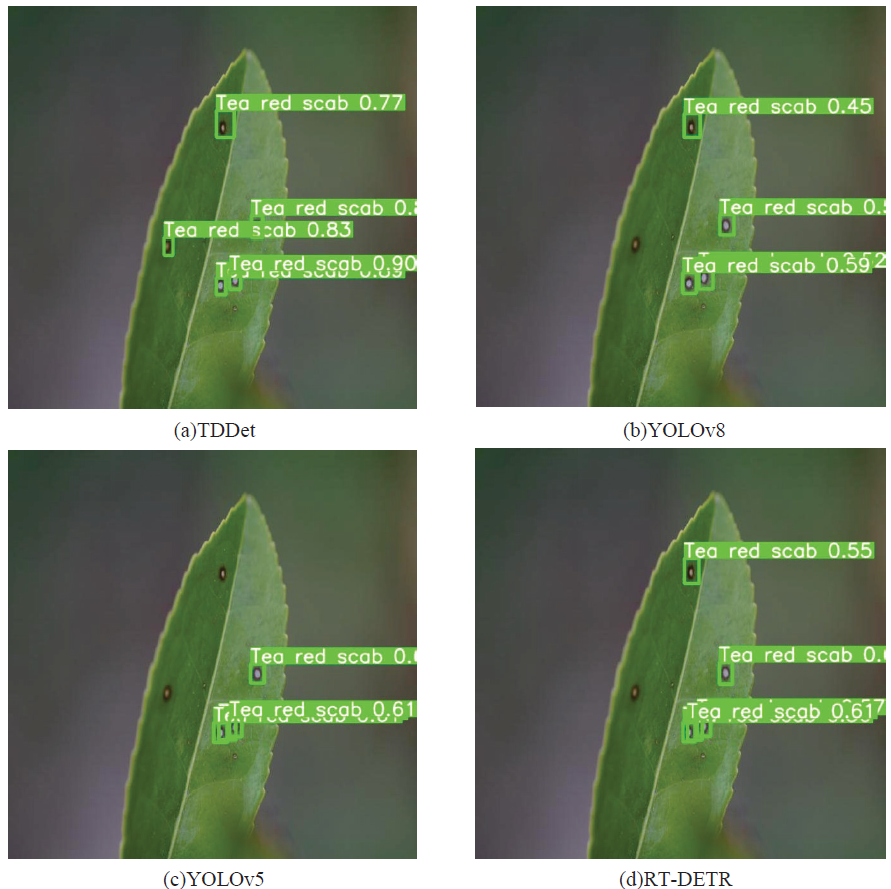
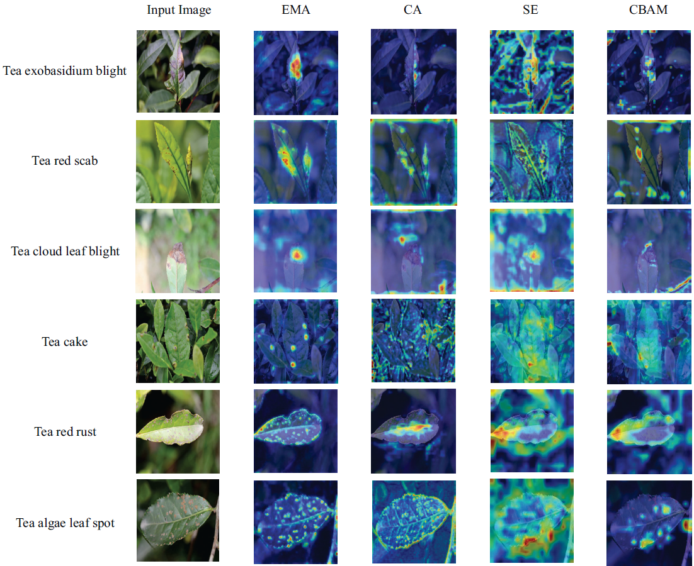

# TDDet: A novel Lightweight and Efficient Tea Disease Detector

TDDet is an lightweight and efficient tea disease detector for quickly and accurately detecting tea diseases.

## TDDet

*Fig. 3 The framework of TDDet.*

## dataset

download the dataset: [link](https://pan.baidu.com/s/1cACKNPdyohigHbc8gRZ7ng?pwd=4d02) 

## trained model

We provide .pt of our TDDet trained on the dataset: [TDDet.pt](https://pan.baidu.com/s/1lI9vEgrZJqM_uwTRK4GOjA?pwd=hsfs )

## results (Qualitative results)

## results (Qualitative results)

*Fig. 9. Comparison of different models with continuous scale variation*

*Fig. 10.Comparison of the anti-interference capabilities of different models in complex backgrounds*

*Fig. 11. Comparison of different models in detecting small target tea diseases*

*Fig. 12. Comparative Heatmap visualization of attention mechanisms in TDDet*
